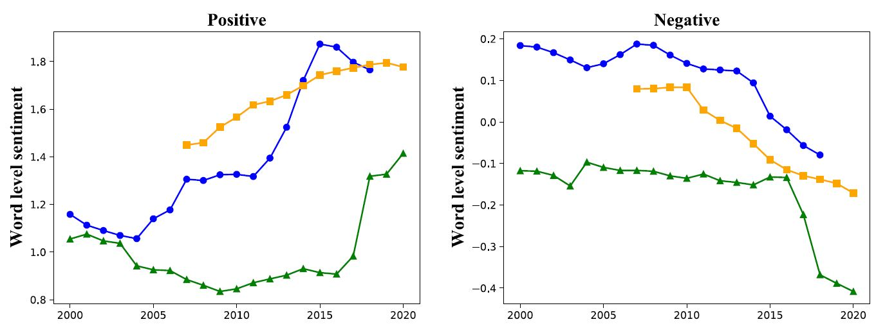

# Rant or Rave: Variation over Time in the Language of Online Reviews
Authors: Yftah Ziser, Bonnie Webber, and Shay Cohen (The University of Edinburgh).

This code repository generates results appearing in the paper ["Rant or Rave: Variation over Time in the Language of Online Reviews"](https://link.springer.com/article/10.1007/s10579-023-09652-5)

## Abstract 
We examine how the language of online reviews has changed over the past 20 years. The corpora we use for this analysis consist of online reviews, each of which is paired with a numerical rating. This allows us to control for the perceived sentiment of a review when examining its linguistic features. Our findings show that reviews have become less comprehensive, and more polarized and intense. We further analyzed two subgroups to understand these trends: (1) reviews labeled “helpful” and (2) reviews posted by persistent users. These trends also exist for helpful reviews (albeit in a weaker form), suggesting that the nature of reviews perceived as helpful is also changing. A similar pattern can be observed in reviews by persistent users, suggesting that these trends are not simply associated with new users but represent changes in overall user behavior. Additional analysis of Booking.com reviews indicates that these trends may reflect the increasing use of mobile devices, whose interface encourages briefer reviews. Lastly, we discuss the implications for readers, writers, and online reviewing platforms.



## Setting up the repository and the data
```bash
git clone https://github.com/yftah89/ReviewsOverTime
cd ReviewsOverTime
wget "https://bollin.inf.ed.ac.uk/public/direct/lre-data.zip"
unzip lre-data.zip -d data
rm lre-data.zip
```
For more information about the data structure, read data/README.md

## Creating a virtual environment 
```bash
python3 -m venv sot
source sot/bin/activate
pip3 install -r requirements.txt
```

## Run main experiments (section 4 in the paper)
We executed our code on a high-performance server with over 250GB of RAM, which proved to be immensely beneficial given the highly parallel nature of the code. However, for those without access to such resources, we offer a memory-constrained option that may result in slightly longer wait times for the results. 
To run the regular version (assuming access to a server with abundant RAM), use the following command:
```
python3 run_main.py
```
If you lack access to a powerful server, you can specify a maximum number of processes for the script, such as 5 (lower values consume less memory), using the following command:
```
python3 run_main.py 5
```
By adjusting the number of processes, you can control memory consumption according to your available resources.

Once the script completes, the corresponding graphs will be generated in the "figs/main" directory, and dictionaries containing the precise values of the experiments will be created in the "results" directory, saved using Pickle.

## Run persistent users experiments (section 5 in the paper)
Similar to the main experiments, we provide with two versions of this script. 
To run the regular version (assuming access to a server with abundant RAM), use the following command:
```
python3 run_pr.py
```
If you lack access to a powerful server, you can specify a maximum number of processes for the script, such as 5 (lower values consume less memory), using the following command:
```
python3 run_pr.py 5
```
By adjusting the number of processes, you can control memory consumption according to your available resources.

Once the script completes, the corresponding graphs will be generated in the "figs/pr" directory, and dictionaries containing the precise values of the experiments will be created in the "results" directory, saved using Pickle.

## Run helpful reviews experiments (section 6 in the paper)
Similar to the main experiments, we provide with two versions of this script. 
To run the regular version (assuming access to a server with abundant RAM), use the following command:
```
python3 run_helpful.py
```
If you lack access to a powerful server, you can specify a maximum number of processes for the script, such as 5 (lower values consume less memory), using the following command:
```
python3 run_helpful.py 5
```
By adjusting the number of processes, you can control memory consumption according to your available resources.

Once the script completes, the corresponding graphs will be generated in the "figs/helpful" directory, and dictionaries containing the precise values of the experiments will be created in the "results" directory, saved using Pickle.

## How to Cite Our Work
```
@article{ziser2023rant,
  author = "Yftah Ziser, Bonnie Webber and Shay B. Cohen",
  journal = "Language Resources and Evaluation",
  year = 2023,
  title = "Rant or rave: variation over time in the language of online reviews",
  doi = {10.1007/s10579-023-09652-5},
  url = {https://doi.org/10.1007/s10579-023-09652-5}
}
```


